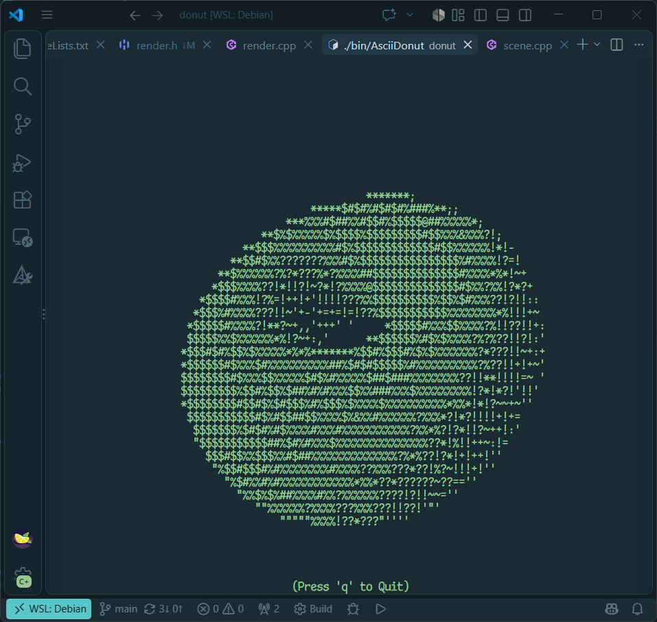

# ASCII Renderer

A terminal ASCII 3D renderer.

<p align="center">
  
</p>

## Dependencies

### Build and runtime

- CMake 3.10 or newer
- A C++ compiler with C++11 support
- A Curses implementation and its development files (`ncurses` on most Linux and macOS systems)
- Python 3
- [uv](https://docs.astral.sh/uv/) (used by CMake to create the Python virtual environment)

## Setup and build

Install `uv` using its [official instructions](https://docs.astral.sh/uv/getting-started/installation/).

From the repository root:

```sh
cmake -S . -B build
cmake --build build
```

The CMake configuration creates a `.venv` with `uv` and installs all dependencies for Pythons cripts.

The compiled executable is written to `build/bin/AsciiDonut` (with `.exe` on Windows).

Run it with:

```sh
./build/bin/AsciiDonut
```

On Windows, use the executable path appropriate for your shell, for example:

```powershell
.\build\bin\AsciiDonut.exe
```

## Controls

- `Space`: pause/resume animation
- `q`, `Q`, or `Esc`: quit

### Font profile generation

The ASCII renderer picks display characters that most closely match the brightness profile of a given region. As character brightness varies from font to font, you may want to regenerate the font profile to match your display font.

The repository includes [dtinth's Comic Mono font](https://github.com/dtinth/comic-mono-font/) under `scripts/fonts/comic_mono/` (this is my terminal display font).

`src/font.h` is generated from a monospace TrueType font. Run the generator from the repository root:

```sh
uv run python ./scripts/font_generate.py
```

Use another font or character set if desired:

```sh
./build/.venv/bin/python scripts/font_generate.py --font path/to/font.ttf --chars " .:-=+*#%@"
```

Add `--debug-glyph` to save rendered glyph previews under `out/glyph/`.
