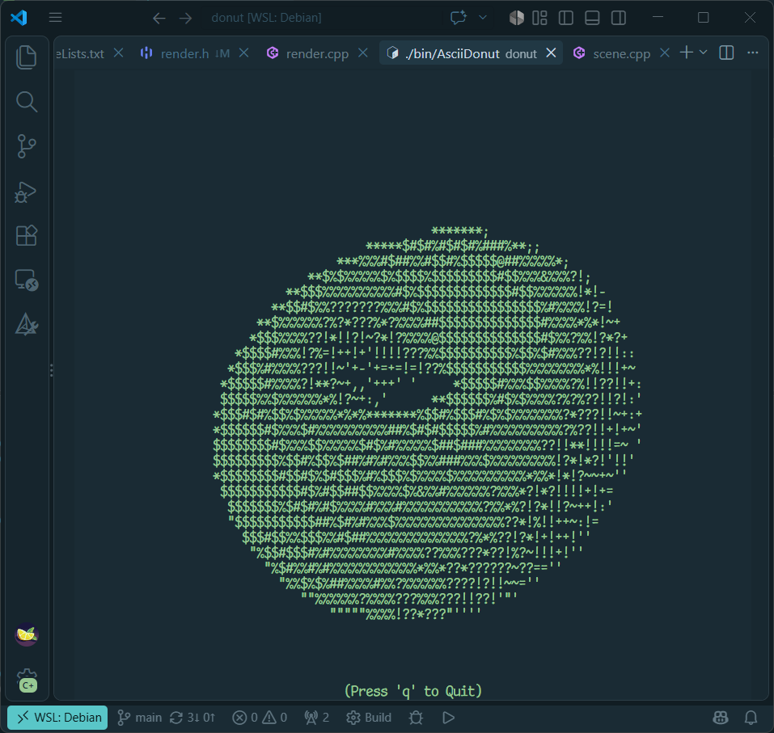

# ASCII Renderer

A terminal ASCII 3D renderer.



## Dependencies

### Build and runtime

- CMake 3.16 or newer
- Ninja 1.10 or newer
- Internet access for CMake to fetch PDCursesMod on Windows and Emscripten

## Native builds

Native builds require a C++11 compiler, a system Curses development package (`ncurses` on Linux and macOS), Python 3, and [uv](https://docs.astral.sh/uv/getting-started/installation/).

### Linux and macOS

Install the platform's `ncurses` development package, then run from the repository root:

```sh
cmake -S . -B build-posix -G Ninja
cmake --build build-posix
./build-posix/bin/AsciiDonut
```

### Windows

Windows uses the PDCursesMod Win32 console backend:

```powershell
cmake -S . -B build-windows -G Ninja
cmake --build build-windows
.\build-windows\bin\AsciiDonut.exe
```

The native CMake configuration creates a `.venv` with `uv` and installs the Python dependencies used by the font profile generator.

## Emscripten build

Install and activate the [Emscripten SDK](https://emscripten.org/docs/getting_started/downloads.html). The `EMSDK` environment variable must point to the SDK directory. In PowerShell, activate it with:

```powershell
& "$env:EMSDK\emsdk.ps1" activate latest
& "$env:EMSDK\emsdk_env.ps1"
```

From the repository root, configure and build the SDL2/PDCurses web target:

```powershell
emcmake cmake -S . -B build-web -G Ninja
cmake --build build-web
```

The generated files are written to `build-web/bin/`, including `AsciiDonut.html`, `AsciiDonut.js`, and `AsciiDonut.wasm`. Serve that directory over HTTP rather than opening the HTML file directly:

```powershell
python -m http.server 8000 --directory build-web\bin
```

Open <http://localhost:8000/AsciiDonut.html> in a browser.

If `emcmake` is not on `PATH`, use the toolchain path supplied by `EMSDK` directly:

```powershell
cmake -S . -B build-web -G Ninja -DCMAKE_TOOLCHAIN_FILE="$env:EMSDK/upstream/emscripten/cmake/Modules/Platform/Emscripten.cmake"
cmake --build build-web
```

The web build uses PDCursesMod's SDL2 backend and does not create the native Python virtual environment.

## Controls

- `Space`: pause/resume animation
- `q`, `Q`, or `Esc`: quit

### Font profile generation

The ASCII renderer picks display characters that most closely match the brightness profile of a given region. As character brightness varies from font to font, you may want to regenerate the font profile to match your display font.

The repository includes [dtinth's Comic Mono font](https://github.com/dtinth/comic-mono-font/) under `scripts/fonts/comic_mono/` (this is my terminal display font).

`src/font.h` is generated from a monospace TrueType font. Run the generator from the repository root:

```sh
uv run python ./scripts/font_generate.py
```

Use another font or character set if desired:

```sh
./build/.venv/bin/python scripts/font_generate.py --font path/to/font.ttf --chars " .:-=+*#%@"
```

Add `--debug-glyph` to save rendered glyph previews under `out/glyph/`.
